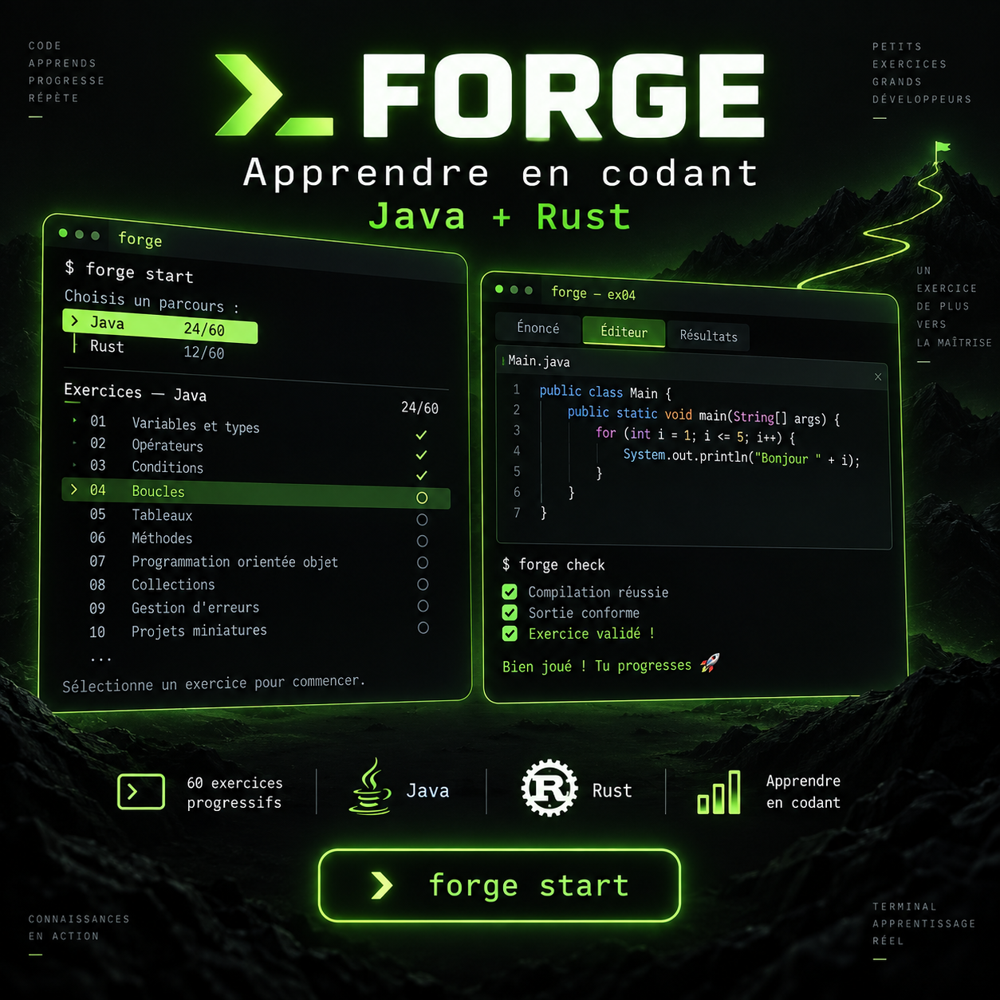

# Forge

<p align="center">
  
</p>

<p align="center">
  <strong>Apprendre Java et Rust en pratiquant, directement dans votre terminal.</strong><br>
  Un parcours progressif en français, avec exercices, mini-leçons, indices et suivi de progression.
</p>

<p align="center">
  <a href="https://github.com/Cliedd/Lama_Facher/releases"></a>
  <a href="https://github.com/Cliedd/Lama_Facher/actions/workflows/ci.yml"></a>
  
  
</p>

Forge is a terminal course for learning Rust and Java through short exercises. Pick a language, read an objective, edit code in the colorized terminal editor, run it against the expected result, reveal a hint when needed, and return later to your saved draft. Progress stays on your computer.

```text
┌─ FORGE ─ Apprendre en pratiquant ───────────────────────────────┐
│  Choisir un langage                    0/… terminés             │
├─ Bienvenue ─────────────────────────────────────────────────────┤
│  Choisis un langage, ouvre un exercice et écris ton code.       │
├─ Choisis ton parcours ──────────────────────────────────────────┤
│  ▸ JAVA   0/… exercices terminés                                │
│    RUST   0/… exercices terminés                                │
└─────────────────────────────────────────────────────────────────┘
  ↑↓ choisir   Entrée ouvrir   F1 aide   q quitter
```

Cette illustration présente l'expérience Forge. Le vrai TUI s'adapte à la largeur du terminal et conserve votre progression localement.

## Pourquoi Forge ?

Forge est conçu pour commencer simplement, comprendre chaque notion et progresser sans se perdre :

- **Un accueil guidé** : choix de Java ou Rust, commandes utiles et repères dès la première ouverture.
- **60 exercices** : 30 en Java et 30 en Rust, du premier `Hello, world!` aux collections, erreurs, traits et mini-projets.
- **Une mini-leçon pour chaque exercice** : objectif clair, explication courte, conseil et indices progressifs.
- **Un éditeur dans le terminal** : code colorisé, diagnostics du compilateur, résultat et validation sans changer de fenêtre.
- **Une progression persistante** : exercices terminés, brouillons, tentatives, prochain exercice et sauvegardes exportables.
- **Une expérience en français** : interface et parcours pensés pour apprendre à son rythme, même en débutant.

## Install and start

Linux or macOS:

```sh
curl --proto '=https' --tlsv1.2 -fsSL https://raw.githubusercontent.com/Cliedd/Lama_Facher/main/install.sh | bash
```

Windows PowerShell:

```powershell
irm https://raw.githubusercontent.com/Cliedd/Lama_Facher/main/install.ps1 | iex
```

Open a new terminal and run `forge doctor`, then `forge start`. The release installer places Forge and the exercises in your user account without administrator access, Git or Cargo. It verifies the archive against the published SHA-256 checksums before installing. Prebuilt releases cover Linux x86-64, macOS Apple Silicon and Intel, and Windows x86-64. Network access is required for installation.

On Linux/macOS the launcher is `~/.local/bin/forge`. If the command is not found, add it to your shell `PATH`:

```sh
export PATH="$HOME/.local/bin:$PATH"
```

Add that line to `~/.bashrc` or `~/.zshrc` for future sessions. On Windows, the installer puts `forge.cmd` in `%LOCALAPPDATA%\Programs\Forge` and adds that directory to the user `PATH`; open a new PowerShell session afterward.

Forge can open without compilers, but completing Rust exercises requires [Rust](https://rustup.rs/) and Java exercises require a JDK with `javac` on `PATH`, such as [Eclipse Temurin](https://adoptium.net/). The editor requires an interactive terminal. Read [`install.sh`](install.sh) or [`install.ps1`](install.ps1) before running them if you prefer to inspect installer code.

## Learning path

1. Lancez `forge start` et choisissez **Java** ou **Rust** avec ↑/↓ puis Entrée.
2. Ouvrez l'exercice recommandé. Lisez la mini-leçon et l'objectif avant de coder.
3. Modifiez le code de départ. F2 révèle un indice, Ctrl+S sauvegarde, Ctrl+R compile et exécute, F1 affiche l'aide.
4. Lisez les diagnostics, corrigez, puis passez à la suite. `forge progress` indique toujours où vous en êtes.

Au premier lancement, Forge demande aussi la langue de l'interface et des exercices. Vous pouvez la changer à tout moment sans perdre votre travail :

```sh
forge language en   # English
forge language fr   # Français
```

Le changement recharge le catalogue traduit, tandis que les mêmes identifiants d'exercices, brouillons, tentatives et validations sont conservés.

You can also work in your own editor:

```sh
forge list --language rust
forge show <exercise-id>
forge run <exercise-id> --file solution.rs
forge progress
```

Use a `.java` file for Java exercises. `forge run <id>` without `--file` uses the saved draft if one exists, otherwise the starter code. `forge test` checks that exercise starter code compiles; it does not grade learner solutions.

| Command | Purpose |
| --- | --- |
| `forge start` or `forge tui` | Open the terminal course |
| `forge lesson java` / `forge lesson rust` | Show the next lesson in a language |
| `forge list --language java` | List exercises and completion status |
| `forge show <id>` | Show an objective and hints |
| `forge run <id> --file solution.java` | Compile and check your solution |
| `forge progress` | Show completion counts and next exercises |
| `forge progress export --format json` | Export a lossless backup to standard output |
| `forge progress export --format csv` | Export a spreadsheet-friendly report |
| `forge progress import backup.json` | Restore or merge a progress backup |
| `forge progress reset --exercise <id>` | Clear one exercise, including its draft |
| `forge progress reset --yes` | Clear all local progress and drafts |
| `forge doctor` | Check compilers, exercise data and progress storage |

To save a backup, redirect the JSON export to a new file before resetting:

```sh
forge progress export --format json > forge-progress-backup.json
forge progress export --format csv > forge-progress.csv
forge progress reset --yes
```

JSON retains exercise IDs, statuses, attempt counts and saved source code. CSV has the columns `exercise_id,status,attempts,last_code`; it quotes commas, quotes and multiline code for spreadsheet import. Exports include saved records for exercises that have since been removed from the course. Use `forge progress import backup.json` to restore a backup safely; local drafts are preserved when both copies differ. Progress normally lives at `~/.config/forge/progress.json` on Unix; `FORGE_PROGRESS_DIR` can override the directory. On Windows, `forge doctor` prints the exact path.

## Update and uninstall

Run the install command again to update. Set `FORGE_VERSION` to a published tag such as `v0.1.0` to select a specific release. `FORGE_INSTALL_DIR` and `FORGE_BIN_DIR` override the install paths on both installer scripts.

Linux/macOS default uninstall:

```sh
rm "$HOME/.local/bin/forge"
rm -r "$HOME/.local/share/forge"
```

Windows PowerShell default uninstall:

```powershell
Remove-Item "$env:LOCALAPPDATA\Programs\Forge\forge.cmd"
Remove-Item "$env:LOCALAPPDATA\Forge" -Recurse
```

Uninstalling keeps progress. Use `forge progress reset --yes` before uninstalling if you also want to clear attempts and drafts.

## Development and release

Install stable Rust and JDK 21, clone this repository, then:

```sh
cargo build --locked
cargo test --locked
cargo run -- doctor
cargo run -- start
```

Run from the repository root, or point `FORGE_HOME` at a directory containing `exercises/`. The terminal rendering smoke test uses Ratatui's in-memory backend, so it runs in CI without a real terminal:

```sh
cargo test --locked --test tui_render
```

For a manual visual check, open `forge tui` in a terminal at least 100 columns by 32 rows and again at a smaller size. Check the language picker, exercise list, editor panels, F1 help, F2 hints, Ctrl+S, Ctrl+R compiler feedback, and Esc. The automated pseudo-terminal smoke test covers `xterm`, `xterm-256color` and `screen-256color`; repeat the checklist in the terminals you support (GNOME Terminal, macOS Terminal and Windows Terminal) to verify fonts, colors and key handling.

Use the [terminal verification checklist](docs/TUI_VERIFY.md) to record each emulator's result.

Program runs have a 5 second timeout; compilation has 30 seconds. Each output stream is capped at 1 MiB while running or 8 MiB while compiling. On Unix, Forge also caps native program address space at 512 MiB; Java uses a 256 MiB heap and 128 MiB metaspace cap. Programs run in a temporary working directory. These limits prevent common hangs and excessive output, but they do not provide a security sandbox: code can still access your files and network with your account permissions. Run only code you trust. Adjust the timeouts with `FORGE_RUN_TIMEOUT_MS` and `FORGE_COMPILE_TIMEOUT_MS` when a legitimate exercise needs longer.

In the TUI, compilation and validation run in the background. The editor shows an in-progress message and remains responsive; editing is briefly paused until the result arrives. F1 and Ctrl+Q remain available.

The workflow in [`.github/workflows/ci.yml`](.github/workflows/ci.yml) builds and tests on Linux, macOS Apple Silicon and Intel, and Windows. It also runs the pseudo-terminal TUI smoke test on Unix. To publish a release, first ensure the version in `Cargo.toml` matches the tag, verify the CI checks on `main`, and create and push that tag:

```sh
git tag v0.1.0
git push origin v0.1.0
```

The tag workflow packages the platform binaries with exercises, generates `SHA256SUMS`, and attaches the archives to GitHub Releases. See [release instructions](docs/RELEASING.md) for the exact asset names and checksum verification. Check the release workflow and assets before sharing the one-command installers. A tag is a public release action; only push it when the build and course content are ready.
